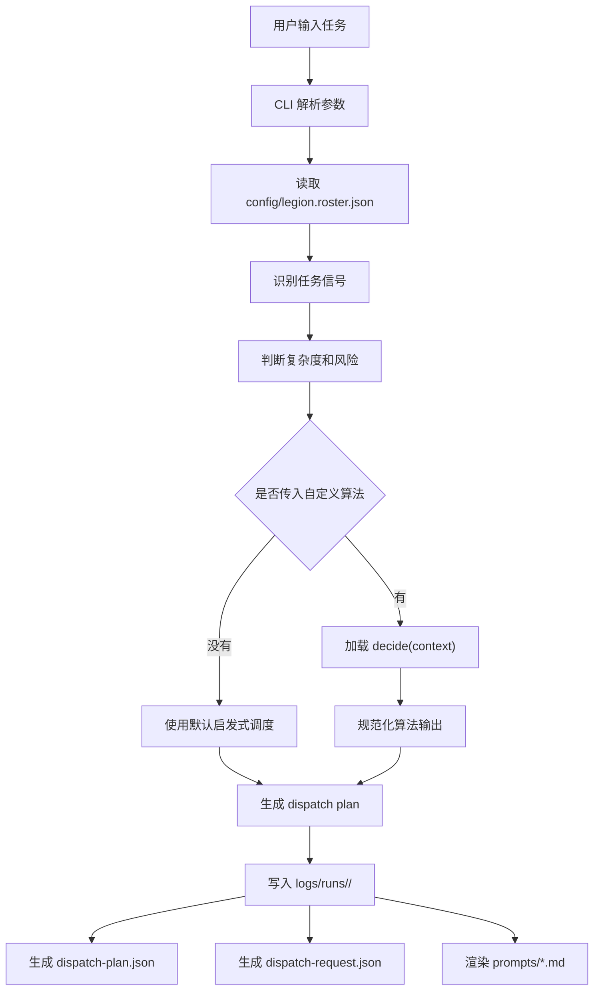

# Codex Agent Legion 实现原理与 GitHub 使用指南

这篇文档讲两件事：

1. Codex Agent Legion 整体是怎么实现的。
2. 别人从 GitHub 拿到这个项目以后，应该怎么安装、运行和接入自己的任务。

项目地址：

https://github.com/ergou-yu/codex-agent-legion

在线说明页：

https://ergou-yu.github.io/codex-agent-legion/

## 这个项目到底是什么

Codex Agent Legion 不是一个在线服务，也不是一个真正会自动启动很多 agent 的后台系统。它更像一个本地调度控制台：

你输入一个任务，它根据任务内容判断：

- 这个任务是否需要拆给子 agent。
- 需要几个子 agent。
- 应该选 explorer、worker、reviewer，还是外部候选 agent。
- 哪些事情必须留给主 Codex 自己做。
- 最后生成哪些 prompt 和 JSON 计划文件。

它的核心产物不是“直接执行结果”，而是一份可检查、可审计、可交给 Codex 继续执行的调度计划。

## 整体运行流程



一次命令大概是这样：

```bash
node tools/legionctl.js plan "帮我分析这个项目并修复构建失败" --json
```

CLI 会把任务变成一组结构化信号，比如：

- `domains`: 任务属于代码、研究、浏览器、数据、文档、审查、工作流还是运维。
- `complexity`: `simple`、`standard`、`complex` 或 `epic`。
- `risk_flags`: 是否涉及密钥、登录态、发消息、付款、生产写入等风险。
- `requested_agent_count`: 用户有没有明确要求几个 agent。

然后它用这些信号决定要不要拆任务，以及拆给谁。

## 核心文件怎么分工

### 1. `tools/legionctl.js`

这是项目的核心 CLI。

它主要做这些事：

- `parseArgs`: 解析命令行参数，比如 `plan`、`doctor`、`--json`、`--algorithm`。
- `detectDomains`: 从任务文字里识别任务领域，比如代码、文档、数据、浏览器、审查。
- `detectRiskFlags`: 判断任务是否涉及敏感动作。
- `inferComplexity`: 根据任务长度和领域数量推断复杂度。
- `targetAgentCount`: 根据复杂度、风险和用户显式要求决定子 agent 数量。
- `heuristicPlan`: 默认调度策略，选择 explorer、worker、reviewer 或外部候选 agent。
- `loadAlgorithm`: 加载用户自定义的调度算法文件。
- `normalizeAlgorithmPlan`: 把自定义算法输出整理成统一格式。
- `buildPlan`: 生成最终 `dispatch-plan.json`。
- `writeRunArtifacts`: 写入 plan、request 和 prompt 文件。
- `doctor`: 检查项目文件、配置、候选 agent、密钥风险和基本健康状态。

也就是说，这个项目的实现重点不是复杂框架，而是把“任务判断 - agent 选择 - 计划生成 - prompt 输出”这条链路做成稳定的本地工具。

### 2. `config/legion.roster.json`

这是军团名册，也是调度策略的配置中心。

里面定义了：

- commander 是谁。
- commander 能做什么，不能委托什么。
- 默认最多允许几个并行 agent。
- 敏感任务最多允许几个 agent。
- 内置 Codex agent 有哪些。
- 外部开源 agent 候选有哪些。
- 每个 agent 对应哪个 prompt 模板。

默认 commander 是：

```json
{
  "id": "codex-gpt55-commander",
  "runtime": "codex",
  "model": "gpt-5.5"
}
```

默认策略是保守的：

- 优先用 Codex 内置子 agent。
- 外部 agent 默认只是候选，不会自动启动。
- reviewer 通常放在实现之后的后置波次。
- 涉及敏感操作时减少 delegation。

### 3. `prompts/*.md`

这里放的是不同角色的 prompt 模板。

例如：

- `prompts/commander.md`: 主 Codex 的总控提示。
- `prompts/explorer.md`: 负责读上下文和定位边界。
- `prompts/worker.md`: 负责明确范围内的实现。
- `prompts/reviewer.md`: 负责检查风险和测试缺口。
- `prompts/browser.md`: 浏览器任务候选模板。
- `prompts/data.md`: 数据任务候选模板。
- `prompts/workflow-runtime.md`: 长链路工作流候选模板。

运行 `army-plan` 后，工具会把任务、分工、范围、禁止事项和验收标准填进这些模板，生成可以交给 Codex 或外部 agent 的任务包。

### 4. `schemas/*.json`

这里定义机器可读的数据契约。

- `dispatch-request.schema.json`: 输入请求的结构。
- `task-plan.schema.json`: 调度计划的结构。
- `agent-result.schema.json`: 子 agent 回传结果的结构。
- `review-finding.schema.json`: reviewer 发现问题的结构。

这些 schema 的意义是：以后你接入自己的调度算法时，不需要猜 CLI 要什么格式，直接按合同输出即可。

### 5. `scripts/army-*`

这些是更顺手的入口脚本。

常用的是：

```bash
scripts/army-plan "你的任务"
scripts/army-doctor
```

它们内部还是调用 `tools/legionctl.js`，只是比每次写 `node tools/legionctl.js ...` 更适合日常使用。

### 6. `examples/custom-algorithm.sample.js`

这是自定义调度算法示例。

你以后可以写自己的 `decide(context)`，让它决定应该选哪些 agent：

```js
async function decide({ task, request, roster, signals }) {
  return {
    strategy: "my-algorithm-v1",
    selected_agents: [
      {
        id: "codex-explorer",
        role: "Explorer",
        reason: "先读仓库结构和风险边界",
        count: 1
      },
      {
        id: "codex-reviewer",
        role: "Reviewer",
        reason: "最后检查计划和测试缺口",
        count: 1
      }
    ]
  };
}

module.exports = { decide };
```

运行：

```bash
node tools/legionctl.js plan "分析这个项目的架构" --algorithm ./my-algorithm.js --json
```

## 为什么 reviewer 要放在后面

这个项目里一个很重要的默认设计是：

reviewer 不和 worker 放在同一个执行波次里。

原因很简单：实现还没完成时，reviewer 很容易看到半成品，然后给出不稳定的结论。这里默认把实现 agent 放在前一波，把 reviewer 放在后一波，让它审查已经形成的 diff、计划或输出。

在 `dispatch-plan.json` 里会看到类似结构：

```json
{
  "parallel_groups": [
    ["codex-worker"],
    ["codex-reviewer"]
  ]
}
```

这表示 worker 先做，reviewer 后审。

## 从 GitHub 怎么用

### 方式一：直接 clone 仓库运行

适合想看源码、改配置、接入自己算法的人。

```bash
git clone https://github.com/ergou-yu/codex-agent-legion.git
cd codex-agent-legion
npm test
```

生成一个调度计划：

```bash
scripts/army-plan "帮我审查这个项目的发布风险" --json
```

或者：

```bash
node tools/legionctl.js plan "帮我审查这个项目的发布风险" --json
```

查看健康状态：

```bash
scripts/army-doctor
```

输出会在：

```text
logs/runs/<timestamp>-<slug>/
```

里面通常包含：

```text
dispatch-plan.json
dispatch-request.json
prompts/commander.md
prompts/<agent>.md
```

### 方式二：从 GitHub Release 安装本地命令

适合只想用命令，不想改源码的人。

下载 release 包：

```bash
curl -L -o codex-agent-legion-0.1.0.tgz \
  https://github.com/ergou-yu/codex-agent-legion/releases/download/v0.1.0/codex-agent-legion-0.1.0.tgz
```

全局安装：

```bash
npm install -g ./codex-agent-legion-0.1.0.tgz
```

安装后可以直接用：

```bash
army-plan "给这个仓库做一次代码审查" --json
army-doctor
legionctl plan "整理一个发布计划"
```

### 方式三：在自己的项目旁边使用

假设你的项目在：

```text
~/work/my-project
```

你可以把 Codex Agent Legion 单独 clone 到另一个目录：

```bash
git clone https://github.com/ergou-yu/codex-agent-legion.git
cd codex-agent-legion
```

然后用任务描述明确告诉它目标项目：

```bash
scripts/army-plan "请为 ~/work/my-project 做一次构建失败排查计划，需要先读项目结构，再安排实现和审查" --json
```

它会生成调度计划和 prompt。真正执行时，主 Codex 根据生成的 plan 去对应项目里读代码、分配子任务、运行验证。

## 一次真实输出长什么样

运行：

```bash
scripts/army-plan "给这个仓库做一次代码审查" --json
```

可能得到：

```json
{
  "strategy": "conservative-heuristic",
  "commander": "codex-gpt55-commander",
  "model": "gpt-5.5",
  "domains": ["code", "review"],
  "complexity": "standard",
  "selected_agents": [
    {
      "id": "codex-worker",
      "role": "Code Worker",
      "count": 1,
      "runtime": "multi_agent_v1"
    },
    {
      "id": "codex-reviewer",
      "role": "Reviewer",
      "count": 1,
      "runtime": "multi_agent_v1"
    }
  ]
}
```

这不是最终代码改动，而是告诉主 Codex：

1. 这个任务属于代码和审查。
2. 复杂度是标准。
3. 可以拆给一个 worker 和一个 reviewer。
4. reviewer 应该作为后置检查，而不是和 worker 同时抢同一份文件。

## 怎么改成自己的版本

你最可能改这几个地方：

### 改 agent 名册

编辑：

```text
config/legion.roster.json
```

可以新增 agent、减少外部候选、调整最大并行数量，或者改变敏感任务的 agent 上限。

### 改 prompt 模板

编辑：

```text
prompts/*.md
```

如果你希望 worker 更严格、reviewer 更挑剔、explorer 输出更短，就改这里。

### 接自己的调度算法

新建一个文件，比如：

```text
my-scheduler.js
```

导出：

```js
module.exports = {
  async decide(context) {
    return {
      strategy: "my-scheduler",
      selected_agents: [
        {
          id: "codex-explorer",
          role: "Explorer",
          reason: "先读上下文",
          count: 1
        }
      ]
    };
  }
};
```

然后运行：

```bash
node tools/legionctl.js plan "你的任务" --algorithm ./my-scheduler.js
```

## 当前边界

这个项目目前做的是“计划生成”和“任务包生成”，不是完全自动执行器。

也就是说：

- 它会告诉你应该调用哪些 agent。
- 它会生成 prompt 和 JSON 计划。
- 它会检查配置和明显密钥风险。
- 它不会自动拿你的账号去启动外部工具。
- 它不会自动写生产数据库。
- 它不会绕过主 Codex 的最终验收。

这个边界是故意保留的。因为多 agent 系统真正容易出问题的地方，往往不是“不会调用”，而是“调用太多、边界不清、没人验收”。

Codex Agent Legion 的核心价值，就是把边界、数量、角色和验收写清楚。
